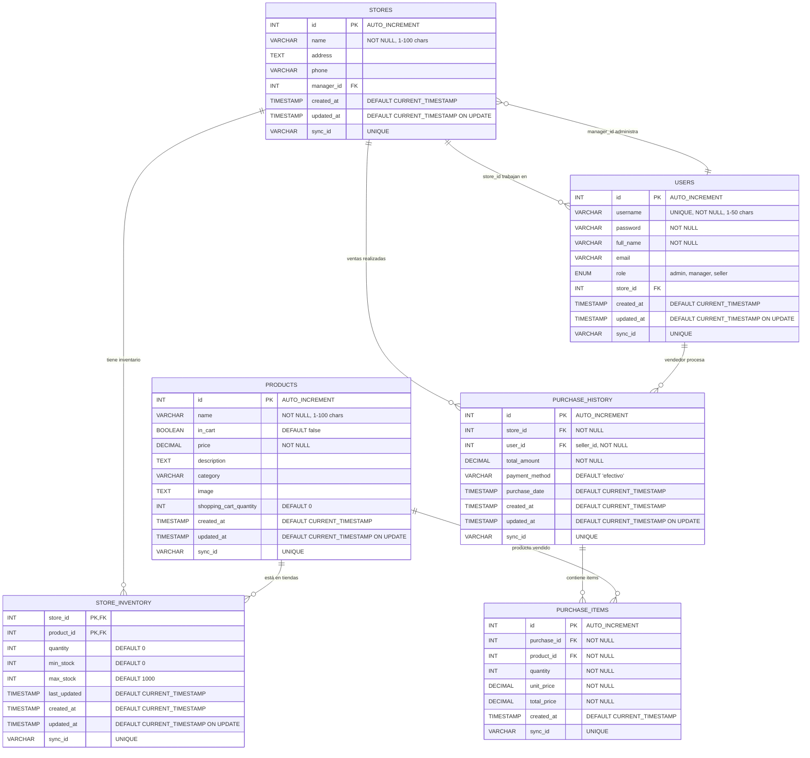

# 📊 Diagrama de Base de Datos - Sistema de Carrito de Compras

## Esquema de la Base de Datos

## 📋 Descripción de Tablas

### 🛍️ **PRODUCTS** (Catálogo de Productos)

- **Propósito**: Almacena el catálogo maestro de productos
- **Campos clave**:
  - `name`: Nombre del producto
  - `price`: Precio unitario
  - `category`: Categoría del producto
  - `in_cart`, `shopping_cart_quantity`: Estado del carrito (Flutter)

### 🏪 **STORES** (Tiendas/Sucursales)

- **Propósito**: Gestiona las diferentes sucursales o puntos de venta
- **Campos clave**:
  - `name`: Nombre de la tienda
  - `address`: Dirección física
  - `manager_id`: Referencia al usuario administrador

### 👥 **USERS** (Usuarios del Sistema)

- **Propósito**: Maneja autenticación y roles de usuarios
- **Roles disponibles**: `admin`, `manager`, `seller`
- **Campos clave**:
  - `username`, `password`: Credenciales de acceso
  - `role`: Nivel de permisos
  - `store_id`: Tienda asignada

### 📦 **STORE_INVENTORY** (Inventario por Tienda)

- **Propósito**: Control de stock por producto y tienda
- **Llave compuesta**: `(store_id, product_id)`
- **Campos clave**:
  - `quantity`: Stock actual
  - `min_stock`, `max_stock`: Límites de inventario

### 🧾 **PURCHASE_HISTORY** (Historial de Ventas)

- **Propósito**: Registro de todas las transacciones de venta
- **Campos clave**:
  - `total_amount`: Monto total de la venta
  - `payment_method`: Método de pago utilizado
  - `purchase_date`: Fecha y hora de la venta

### 📝 **PURCHASE_ITEMS** (Detalles de Venta)

- **Propósito**: Items individuales de cada venta
- **Campos clave**:
  - `quantity`: Cantidad vendida del producto
  - `unit_price`: Precio unitario al momento de la venta
  - `total_price`: Subtotal por producto

## 🔗 Relaciones Principales

1. **Productos ↔ Inventario**: Un producto puede estar en múltiples tiendas con diferentes cantidades
2. **Tiendas ↔ Usuarios**: Una tienda puede tener múltiples empleados, un usuario pertenece a una tienda
3. **Ventas ↔ Tienda/Usuario**: Cada venta está asociada a una tienda específica y procesada por un usuario
4. **Ventas ↔ Items**: Una venta puede contener múltiples productos con diferentes cantidades

## 🔄 Sincronización

Todas las tablas incluyen:

- `sync_id`: UUID único para sincronización entre Flutter y servidor
- `created_at`, `updated_at`: Timestamps para control de versiones
- Soporte para operaciones offline/online

## 🎯 Casos de Uso Principales

1. **Gestión de Inventario**: Control de stock por tienda
2. **Proceso de Ventas**: Registro completo de transacciones
3. **Reportes y Analytics**: Análisis de ventas por período, tienda, vendedor
4. **Control de Acceso**: Autenticación y autorización por roles
5. **Sincronización**: Datos consistentes entre app móvil y servidor
